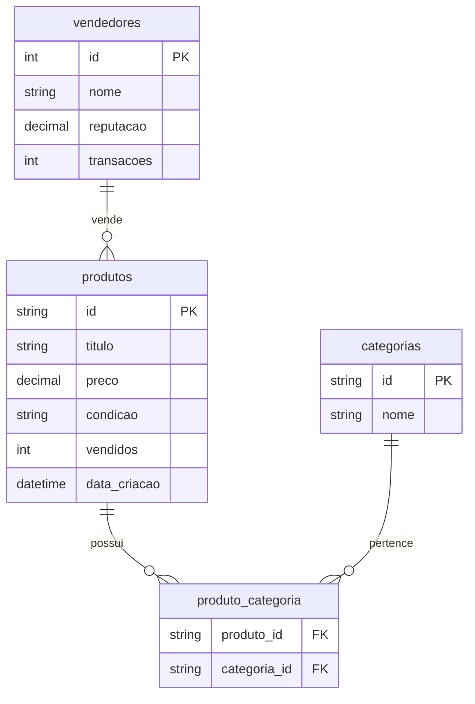

# Project Meli Challenge

Pipeline completo de dados para análise de produtos do Mercado Livre, desenvolvido como solução ao desafio proposto em **Challenge | Analytics Engineer**.

## Visão Geral do Pipeline

| Etapa | Descrição | Tecnologias-Chave |
|-------|-----------|------------------|
| Extração | Coleta de 500 resultados da API | Python, Requests |
| Transformação | Modelagem relacional e ETL | Pandas, SQLite |
| Visualização | Dashboard interativo | Plotly, Jupyter |

## Pré-requisitos

- Python 3.8+
- Gerenciador de pacotes pip
- Jupyter Notebook (para visualização)

## Instalação

```bash
git clone https://github.com/na-geciauskas/projeto-melichallenge.git
cd projeto-melichallenge
pip install -r requirements.txt
```

## Execução

### 1. Extração de dados:
```bash
python src/extraction_meli_challenge.py
```
**Saída**: `data/raw_data.csv`

### 2. Modelagem e Carga:

```sql
-- Arquivo: src/meli_challenge_ddl.sql
-- Modelo otimizado para análise de produtos
CREATE TABLE produtos (
    id VARCHAR(20) PRIMARY KEY,
    titulo TEXT NOT NULL,
    preco DECIMAL(10,2) NOT NULL,
    condicao VARCHAR(20) NOT NULL,
    vendidos INTEGER DEFAULT 0,
    data_criacao TIMESTAMP,
    permalink TEXT
    thumbnail TEXT
);
-- Demais tabelas...
```
```bash
python src/etl_meli_challenge.py
```
**Saída**: `data/mercado_livre.db`

### 3. Visualização:
```bash
jupyter notebook src/meli_challenge_dashboard.ipynb
```


## Estrutura do Projeto

<pre>
project-melichallenge/
├── data/
│   ├── raw_data.csv           # Dados brutos da API
│   └── mercado_livre.db       # Banco de dados SQLite
│
├── src/
│   ├── extraction_meli_challenge.py          # Código de extração (Passo 1)
│   ├── meli_challenge_ddl.sql                # DDL do modelo (Passo 2)
│   ├── etl_meli_challenge.py                 # Código ETL (Passo 2)
│   └── meli_challenge_dashboard.ipynb        # Jupyter notebook (Passo 3)
│
├── README.md                  # Documentação completa
└── requirements.txt           # Dependências do projeto
</pre>


## Destaques Técnicos

### Extração
- Paginação inteligente (`offset` + `limit`)
- Tratamento de rate limits (429)
- Timeout configurável (30s)

### Modelagem



### Visualização
- Filtros dinâmicos por:
  - Faixa de preço (slider)
  - Categoria (dropdown)
- Métricas em tempo real

## Licença

Este projeto está licenciado sob a licença MIT - veja o arquivo [LICENSE](LICENSE) para detalhes.

## Contato

[](https://linkedin.com/in/nara-geciauskas-ramos-castillo)
[](mailto:na.geciauskas@gmail.com)
